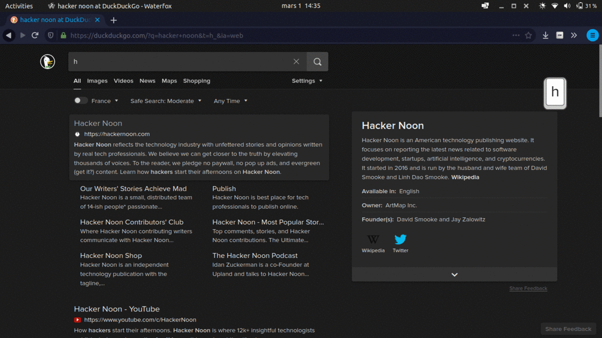

# Screen key

*Display key pressed to show them during a streaming or screen sharing in your browser*
*Useful to compose some demo gif or screenshots*

 

## Install Extension

|Platform|Link|
|:-:|:-:|
|| [Firefox Extension](https://addons.mozilla.org/addon/screen-key/)|

## How to use

1. click on the icon of the addon to swich it on

2. test your keyboard, key will appear on the right of your screen

## ScreenShots

## About Screen key

Feel free to open issues or pull requests!

## Privacy

This extension **DO NOT** read or save any of your informations. 

#### dev with <3 by @aloisleclet
